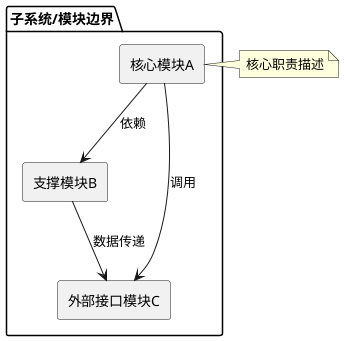
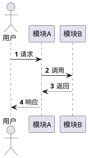
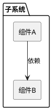
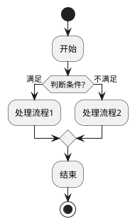

# 功能设计说明书

## 目录

1. [功能概述](#1-功能概述)
2. [增量SR清单](#2-增量sr清单)
3. [需求点厘清](#3-需求点厘清)
4. [方案设计细节](#4-方案设计细节)
   - [4.1 架构决策记录（ADR）](#41-架构决策记录adr)
   - [4.2 4+1视图（按需选用）](#42-41视图按需选用)
   - [4.3 接口契约（设计级）](#43-接口契约设计级)
   - [4.4 DFX设计要点](#44-dfx设计要点)
5. [SR→AR分配](#5-srar分配)
   - [5.1 分配需求列表](#51-分配需求列表)
   - [5.2 SR→AR追踪矩阵](#52-srar追踪矩阵)
6. [依赖关系](#6-依赖关系)
   - [6.1 模块依赖关系](#61-模块依赖关系)
   - [6.2 周边依赖关系](#62-周边依赖关系)
7. [合规设计](#7-合规设计)
8. [性能功耗设计](#8-性能功耗设计)
9. [DFX分析](#9-dfx分析)
10. [FMEA分析](#10-fmea分析)
11. [功能规格变更](#11-功能规格变更)
12. [附录](#12-附录)

---

# 1. 功能概述

[对本功能设计的整体概述，说明设计意图、核心架构策略]

**架构总览图**（使用 PlantUML 组件图）：

---

# 2. 增量SR清单

| SR编号 | SR标题 | SR描述 | 版本号 |
|--------|--------|--------|--------|

---

# 3. 需求点厘清

> [!IMPORTANT]
> 本章节聚焦厘清需求要点，确保功能设计有明确的需求基线支撑。

| 需求维度 | 内容 |
|---------|------|
| 输入 | [数据/事件/触发条件] |
| 输出 | [结果/状态变更/副作用] |
| 前置条件 | [必须满足的前提] |
| 后置条件 | [执行后的系统状态] |
| 约束条件 | [性能/安全/可靠性约束] |
| 验收标准 | AC-1: [标准]; AC-2: [标准] |

---

# 4. 方案设计细节

## 4.1 架构决策记录（ADR）

| ADR字段 | 内容 |
|---------|------|
| ADR编号 | ADR-[SR编号]-[序号] |
| 决策标题 | [架构决策标题] |
| 状态 | [提议/已决定/已替代] |
| 背景 | [为什么需要做这个决策] |
| 决策 | [选择了什么方案] |
| 候选方案 | [列出所有候选方案及对比分析] |
| 理由 | [选择依据] |

**方案对比分析**（关键决策点必须提供 ≥2 候选方案）：

| 评估维度 | 权重 | 方案 A | 方案 B |
|---------|------|--------|--------|
| [维度1] | [%] | [评分] | [评分] |
| [维度2] | [%] | [评分] | [评分] |
| **加权总分** | 100% | **X** | **Y** |

→ **SE推荐**：方案 [X]
→ **决策依据**：[阐述理由]

## 4.2 4+1视图（按需选用）

> [!NOTE]
> 4+1视图按需选用，删除未使用的视图占位符。以下保留最常用的 3 种视图模板。
> 如需场景视图（用例图）、逻辑视图（类图）、物理视图（部署图）、状态变迁（状态图），
> 参考 `references/diagram_guide.md` 中对应示例添加。
> 统一使用 PlantUML 格式，不使用 Mermaid。

### 过程视图（时序图）— 多模块交互时必选

### 开发视图（组件图）— 模块拆分时必选

### 流程图（PlantUML Activity）— 业务流程时选用

## 4.3 接口契约（设计级）

> [!NOTE]
> 聚焦接口语义和交互协议，不涉及代码级实现细节。

### 调用接口

| 接口名称 | 调用方 | 提供方 | 功能描述 | 协议/机制 |
|---------|--------|--------|---------|-----------|

### 提供接口

| 接口名称 | 提供方 | 调用方 | 功能描述 | 协议/机制 |
|---------|--------|--------|---------|-----------|

### 进程间通信

| IPC名称 | 通信方 | 数据方向 | 通信机制 | 说明 |
|---------|--------|---------|---------|------|

### 接口交互时序

[使用 PlantUML 时序图表达接口交互协议，参考 `references/diagram_guide.md` 时序图示例]

## 4.4 DFX设计要点

| DFX维度 | 设计要点 | 关联SR |
|---------|---------|--------|
| 可靠性 | [容错策略/降级方案] | [SR编号] |
| 安全性 | [权限设计/加密策略] | [SR编号] |
| 可测试性 | [测试策略/验证点] | [SR编号] |
| 性能 | [性能目标/优化策略] | [SR编号] |
| 可扩展性 | [模块化/隔离设计] | [SR编号] |

---

# 5. SR→AR分配

## 5.1 分配需求列表

| SR编号 | SR标题 | AR编号 | AR描述 | 分配目标（子系统/模块） | 设计责任人 | 优先级 |
|--------|--------|--------|--------|----------------------|----------|--------|

## 5.2 SR→AR追踪矩阵

[使用 GraphViz DOT 表达 SR→AR 分配追踪关系，参考 `references/diagram_guide.md` GraphViz 部分]

---

# 6. 依赖关系

## 6.1 模块依赖关系

[使用 GraphViz DOT 表达模块间复杂依赖关系，参考 `references/diagram_guide.md` GraphViz 部分]

## 6.2 周边依赖关系

| 依赖类别 | 依赖项 | 说明 |
|---------|--------|------|

---

# 7. 合规设计

## 7.1 内容合规设计

## 7.2 伦理设计

## 7.3 本地遵从设计

## 7.4 漏洞修补方案设计

## 7.5 个人数据落盘存储安全设计

## 7.6 安全配置设计

---

# 8. 性能功耗设计

| 性能/功耗指标 | 目标值 | 测量方法 |
|-------------|--------|---------|

---

# 9. DFX分析

> [!NOTE]
> 按需展开以下 DFX 维度，不涉及的可标注"不适用"并说明原因。

## 9.1 可靠性分析

## 9.2 安全性分析

## 9.3 可扩展性设计

## 9.4 可配置性设计

## 9.5 可测试性设计

## 9.6 兼容性设计

---

# 10. FMEA分析

| 关联功能 | 失效模式 | 触发条件 | 影响等级 | 检测方法 | 补偿措施 | 严重度(S) | 频度(O) | 不易探测度(D) | RPN值 | 提取需求 |
|----------|----------|----------|----------|----------|----------|-----------|---------|---------------|-------|----------|

---

# 11. 功能规格变更

[记录本次设计过程中对原始需求规格的变更说明]

---

# 12. 附录