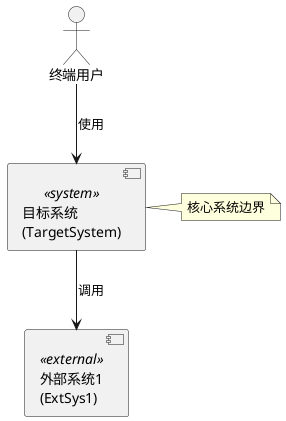
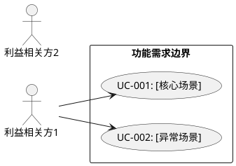

# 需求分析说明书

## 目录

- [1. 简介](#1-简介)
  - [1.1 目的](#11-目的)
  - [1.2 范围](#12-范围)
  - [1.3 假设和约束](#13-假设和约束)
  - [1.4 术语与缩写](#14-术语与缩写)
- [2. 系统上下文](#2-系统上下文)
- [3. 需求分析概述](#3-需求分析概述)
  - [3.1 需求概述](#31-需求概述)
- [4. 需求场景分析](#4-需求场景分析)
  - [4.1 结构化IR](#41-结构化ir)
  - [4.2 用例分析](#42-用例分析)
- [5. IR→SR需求分解](#5-irsr需求分解)
  - [5.1 分解策略](#51-分解策略)
  - [5.2 SR列表](#52-sr列表)
  - [5.3 IR→SR追踪矩阵](#53-irsr追踪矩阵)
- [6. 功能性需求分析](#6-功能性需求分析)
- [7. 非功能性需求分析](#7-非功能性需求分析)
  - [7.1 定界定位需求分析](#71-定界定位需求分析)
  - [7.2 系统可靠性/可用性分析](#72-系统可靠性可用性分析)
  - [7.3 安全韧性隐私需求分析](#73-安全韧性隐私需求分析)
  - [7.4 可服务性需求分析](#74-可服务性需求分析)
  - [7.5 生命周期需求分析](#75-生命周期需求分析)
  - [7.6 漏洞需求分析](#76-漏洞需求分析)
  - [7.7 可测试性需求分析](#77-可测试性需求分析)
  - [7.8 功能安全需求分析](#78-功能安全需求分析)
  - [7.9 合规性需求分析](#79-合规性需求分析)
  - [7.10 开发者资料开发需求分析](#710-开发者资料开发需求分析)
  - [7.11 伦理&AI治理需求分析](#711-伦理ai治理需求分析)
  - [7.12 本地遵从需求分析](#712-本地遵从需求分析)
  - [7.13 其他DFX需求分析](#713-其他dfx需求分析)
- [8. 系统影响分析](#8-系统影响分析)
- [9. 架构决策记录](#9-架构决策记录)
- [10. 专利识别](#10-专利识别)
- [11. 附录](#11-附录)
- [12. 参考资料](#12-参考资料)

---

# 1. 简介

## 1.1 目的

[说明本文档的目的：将IR初始需求转化为结构化的SR系统需求，确保需求的完整性、可追溯性和无歧义性。]

## 1.2 范围

[说明本文档覆盖的需求范围，涉及的系统/子系统/模块边界。]

## 1.3 假设和约束

[列出需求分析过程中的假设前提和已知约束条件。]

## 1.4 术语与缩写

| 缩写 | 全称 | 含义 |
|------|------|------|
| IR | Initial Requirement | 初始需求（MKT录入） |
| SR | System Requirement | 系统需求（SE分解） |
| AR | Allocated Requirement | 分配需求（分配到子系统） |
| ADR | Architecture Decision Record | 架构决策记录 |
| DFX | Design for X | 面向X的设计 |
| FMEA | Failure Mode and Effects Analysis | 失效模式与影响分析 |

---

# 2. 系统上下文

[使用 PlantUML Component 图表达系统边界、外部依赖、用户关系，参考 `references/diagram_guide.md` 系统上下文图示例]

---

# 3. 需求分析概述

## 3.1 需求概述

[对本次需求的整体概述，包括需求背景、核心价值、影响范围等。]

---

# 4. 需求场景分析

## 4.1 结构化IR

### 设计资产

| 设计资产 | 内容 | owner |
|----------|------|-------|
| IR标识 | | MKT |
| 名称 | | MKT |
| 描述 | | MKT |
| RR标识 | | MKT |
| 优先级 | | MKT |
| Who | | SE,MKT |
| What | | SE |
| Why | | SE |
| When | | SE |
| Where | | SE |
| How | | SE |
| How much | | SE |
| 类别 | | SE |
| 场景列表 | | SE |
| 系统接口定义（可选） | | SE |

## 4.2 用例分析

[使用 PlantUML 用例图表达核心场景]

---

# 5. IR→SR需求分解

## 5.1 分解策略

[说明本次需求分解的策略选择：按功能维度/场景维度/DFX维度分解，以及分解的理由。]

## 5.2 SR列表

| 序号 | IR编号 | IR描述 | SR编号 | SR标题 | SR描述 | 类别 | 验收标准 | 关联功能 |
| ---- | ------ | ------ | ------ | ------ | ------ | ---- | -------- | -------- |

## 5.3 IR→SR追踪矩阵

[使用 GraphViz DOT 表达 IR→SR 追踪关系，参考 `references/diagram_guide.md` GraphViz 部分]

---

# 6. 功能性需求分析

[详细描述每个功能性需求，包含输入/输出/前置条件/后置条件/约束条件]

---

# 7. 非功能性需求分析

## 7.1 定界定位需求分析

| 类型 | 名称 | 描述 | 编号 | 功能 | 生成SR | 分析结论 | 分析备注 |
| ---- | ---- | ---- | ---- | ---- | ------ | -------- | -------- |

## 7.2 系统可靠性/可用性分析

| 类型 | 名称 | 描述 | 编号 | 功能 | 生成SR | 分析结论 | 分析备注 |
| ---- | ---- | ---- | ---- | ---- | ------ | -------- | -------- |

## 7.3 安全韧性隐私需求分析

| 类型 | 名称 | 描述 | 编号 | 功能 | 生成SR | 分析结论 | 分析备注 |
| ---- | ---- | ---- | ---- | ---- | ------ | -------- | -------- |

## 7.4 可服务性需求分析

## 7.5 生命周期需求分析

## 7.6 漏洞需求分析

## 7.7 可测试性需求分析

## 7.8 功能安全需求分析

## 7.9 合规性需求分析

## 7.10 开发者资料开发需求分析

## 7.11 伦理&AI治理需求分析

## 7.12 本地遵从需求分析

## 7.13 其他DFX需求分析

---

# 8. 系统影响分析

[分析本次需求对现有系统的影响范围，包括影响的模块/子系统/接口/数据等]

---

# 9. 架构决策记录

| ADR编号 | 决策标题 | 状态 | 背景 | 决策 | 候选方案 | 理由 |
|---------|---------|------|------|------|---------|------|

---

# 10. 专利识别

[识别本次需求涉及的可专利点]

---

# 11. 附录

---

# 12. 参考资料