# 图形化表达规范

本文件为 SE Design Skill 的图形化表达参考指南。当 SKILL.md 中指示"参考 diagram_guide"时，读取本文件。

---

## 图形表达策略

交互阶段（Phase 1-4）使用 **ASCII 字符图**，保证终端/CLI 直读可见；归档阶段（Phase 5）使用 **PlantUML/GraphViz** 源码，渲染为 PNG 嵌入 Docx。

| 阶段 | 展示方式 | 优势 | 适用场景 |
|------|---------|------|---------|
| **交互阶段** | ASCII 字符图 | 终端直读、无需渲染工具、零依赖 | Phase 1-4 所有图表展示 |
| **归档阶段** | PlantUML/DOT 源码 | 专业级图表质量、PNG 嵌入 Docx | Phase 5 文档归档 |

---

## ASCII 字符图 — 交互阶段专用

ASCII 字符图使用 Unicode box-drawing 字符（┌ ─ ┐ │ └ ┘ ├ ┤ ┬ ┴ ┼ → ← ↑ ↓ v），在终端中直接可读。

### 系统上下文图

```
┌──────────────┐     ┌──────────────────┐     ┌──────────────┐
│  终端用户     │────>│  目标系统         │────>│  外部系统A    │
│  (User)      │ 使用 │  (TargetSystem)  │ API │  (ExtSysA)   │
└──────────────┘     └──────────────────┘     └──────────────┘
                           │
                           │ IPC
                           v
                     ┌──────────────┐
                     │  外部系统B    │
                     │  (ExtSysB)   │
                     └──────────────┘
```

绘制规则：
- 每个角色/系统占一个方框，方框宽度对齐
- 箭头 `──>` 表示主动调用方向，标注交互方式（API/IPC/使用）
- 外部系统用独立方框，不放在目标系统方框内
- 中文标签在上行，英文标识在下行

### 时序图

```
用户          模块A         模块B         外部服务C
 │             │             │             │
 │──请求──────>│             │             │
 │             │──调用接口──>│             │
 │             │             │──数据查询──>│
 │             │             │<──查询结果──│
 │             │<──处理结果──│             │
 │<──最终响应──│             │             │
```

绘制规则：
- 参与者列用空格对齐，间隔约8字符
- `──>` 表示请求方向，`<──` 表示响应方向
- 消息标注写在箭头线上方
- `│` 表示参与者生命线

### 用例图

```
                    ┌────────────────────────────┐
                    │        目标系统              │
                    │                              │
  (终端用户) ──────>│  UC-001: 核心场景            │
                    │  UC-002: 配置管理            │<──── (运营方)
                    │  UC-003: 数据查询            │
                    │      │                       │
                    │      └<<extend>>             │
                    │      v                       │
                    │  UC-004: 异常处理            │<──── (第三方应用)
                    │                              │
                    └────────────────────────────┘
```

绘制规则：
- 系统边界用大方框表示
- 用例用 `UC-编号: 名称` 格式
- 角色在方框外侧，箭头指向相关用例
- `<<extend>>` / `<<include>>` 用垂直连线表示

### 状态图

```
  [*]──初始化──> Idle
                  │
                  │ 接收请求(onRequest)
                  v
               Processing
               ├──处理完成(onComplete)──> Success ──重置(onReset)──> Idle
               └──处理异常(onError)──> Failed
                                            │
                                            │ 重试策略触发
                                            v
                                         Retry ──maxRetry>0──> Processing
                                            │
                                            │ 超过最大重试次数
                                            v
                                         Error ──上报告警──> [*]
```

绘制规则：
- `[*]` 表示初始/终止状态
- `──>` 表示状态转换，标注触发事件(event)
- 分支用 `├──` 和 `└──` 表示
- 状态名用英文，事件标注用中文或 `event名` 格式

### 组件图

```
┌─ 子系统边界 ───────────────────────────────────┐
│                                                   │
│  ┌──────────┐        ┌──────────┐               │
│  │ 核心模块A │───────>│ 支撑模块B │               │
│  │ (ModuleA) │ 依赖   │ (ModuleB) │               │
│  └──────────┘        └──────────┘               │
│       │                                           │
│       │ 调用                                      │
│       v                                           │
│  ┌──────────┐                                     │
│  │ 外部接口C │                                     │
│  │ (ModuleC) │                                     │
│  └──────────┘                                     │
│                                                   │
└───────────────────────────────────────────────────┘
```

绘制规则：
- 子系统/模块边界用大方框 `┌─ ─┐` 表示
- 模块用内部方框，标注中文职责 + 英文标识
- `──>` 表示依赖/调用方向，标注交互类型
- 职责描述写在模块方框内

### 追踪矩阵图

```
IR-001: 初始需求描述
  ├──分解──> SR-IR001-001: 系统需求1 ──分配──> AR-IR001-001-01: 分配→子系统X
  └──分解──> SR-IR001-002: 系统需求2 ──分配──> AR-IR001-002-01: 分配→子系统Y
```

绘制规则：
- IR 在顶部，SR 在第二层，AR 在第三层
- `──分解──>` 和 `──分配──>` 标注关系类型
- 编号格式：`SR-[IR编号]-[序号]`，`AR-[IR编号]-[序号]-[子序号]`

### 依赖关系总图

```
SR-IR001-001(核心功能) ─────> AR→子系统X
      │                          │
      │ 依赖                     │
      v                          v
SR-IR001-002(配置管理) ─────> AR→子系统Z

AR→子系统X ──依赖(dashed)──> AR→子系统Z
```

绘制规则：
- SR 在左/上层，AR 在右/下层
- 实线 `────>` 表示分配关系
- 虚线 `──依赖(dashed)──>` 表示跨模块依赖
- 模块名标注在节点旁

### 部署图

```
┌─ 设备1 ────────────┐          ┌─ 设备2 ────────────┐
│                      │          │                      │
│  ┌─ 进程A ─────┐   │          │  ┌─ 进程B ─────┐   │
│  │  (ProcessA)  │   │  IPC    │  │  (ProcessB)  │   │
│  └─────────────┘   │<────────>│  └─────────────┘   │
│                      │          │                      │
└────────────────────┘          └────────────────────┘
```

绘制规则：
- 设备/节点用大外框 `┌─ ─┐`
- 进程用内框 `┌─ ─┐`
- `<──────>` 表示双向通信，标注通信方式（IPC/网络/串口）

---

## ASCII 绘制通用规范

1. **方框对齐**：同行方框宽度一致，使用空格填充
2. **箭头标注**：在箭头线上方或右侧标注交互方式/消息名
3. **中文为主**：标签中文在上，英文标识在下或括号内
4. **编号规范**：SR/AR/UC 编号使用英文，描述使用中文
5. **分支表达**：用 `├──` 和 `└──` 表示多分支
6. **连线长度**：保持箭头线和标注的清晰可读，避免过密

---

## PlantUML — 归档阶段专业 UML 视图

以下为归档阶段（Phase 5）使用的 PlantUML 源码模板。交互阶段的 ASCII 图在归档时替换为对应 PlantUML 源码。

| 视图类型 | IPD阶段 | PlantUML 关键字 | 使用时机 |
|---------|--------|----------------|---------|
| **系统上下文图** | TR1/Phase 3 | component | 系统边界、外部依赖、角色关系 |
| **用例图** | TR1/Phase 3 | UseCase | 多角色交互、场景分析 |
| **类图** | TR2/Phase 4 | class | 业务实体建模、逻辑视图 |
| **时序图** | TR2/Phase 4 | sequenceDiagram | 多模块交互、过程视图 |
| **状态图** | TR2/Phase 4 | stateDiagram | 状态机设计、生命周期建模 |
| **活动图（流程图）** | TR1/TR2 | activityDiagram | 业务流程、决策分支 |
| **组件图** | TR2/Phase 4 | component | 模块拆分、开发视图 |
| **部署图** | TR2/Phase 4 | deployment | 多设备部署、物理视图 |

### 系统上下文图示例

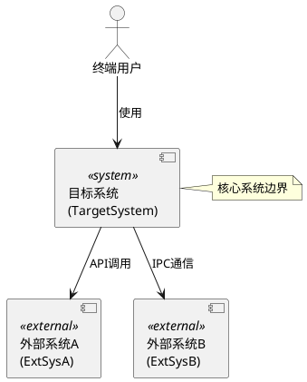

### 用例图示例

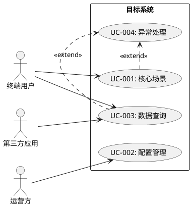

### 时序图示例

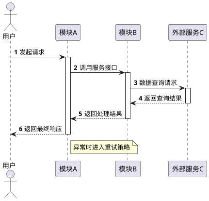

### 状态图示例

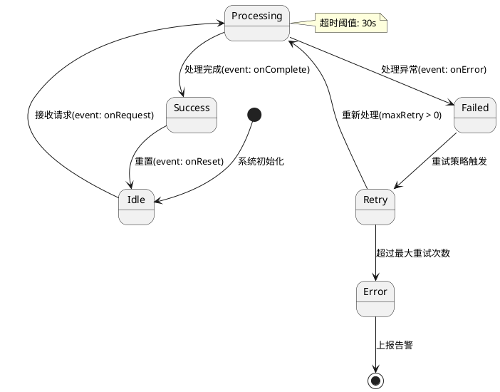

### 活动图示例

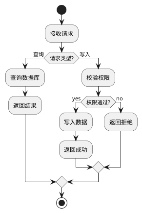

### 类图示例

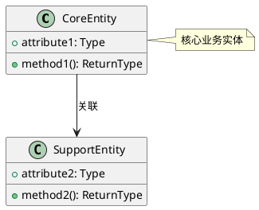

### 组件图示例

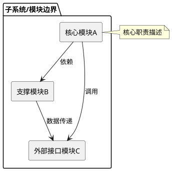

### 部署图示例

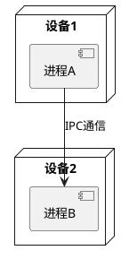

---

## Mermaid — 可选归档补充（需 mmdc）

Mermaid 源码仅在安装了 mermaid-cli (mmdc) 的情况下可选使用，不作为默认归档格式。**推荐优先使用 PlantUML 替代**，PlantUML 已内置 plantuml.jar，无需额外安装。

| 视图类型 | Mermaid 关键字 | PlantUML 替代 |
|---------|---------------|--------------|
| **流程图** | `flowchart TD/LR` | `activityDiagram` |
| **甘特图** | `gantt` | PlantUML 无直接替代 |
| **ER图** | `erDiagram` | PlantUML `class` |
| **思维导图** | `mindmap` | PlantUML `wbs` |

### 流程图示例

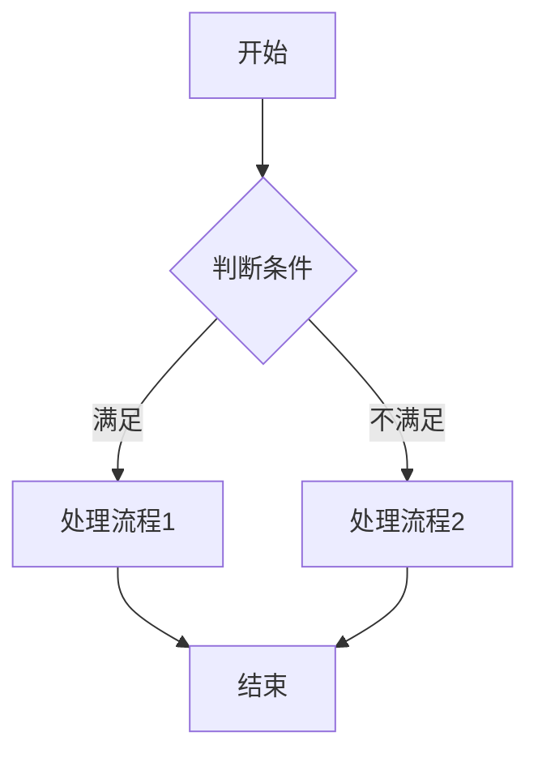

---

## GraphViz (DOT) — 归档阶段复杂依赖视图

当依赖关系节点 > 5 或存在多层嵌套依赖时，归档阶段使用 GraphViz DOT 源码。

### 模块依赖网示例

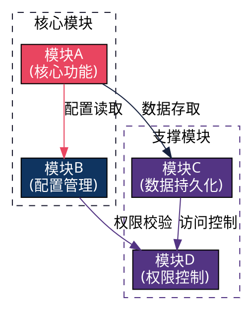

### IR→SR 追踪矩阵图示例

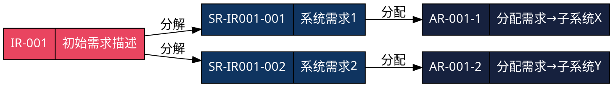

### SR→AR 依赖关系总图示例

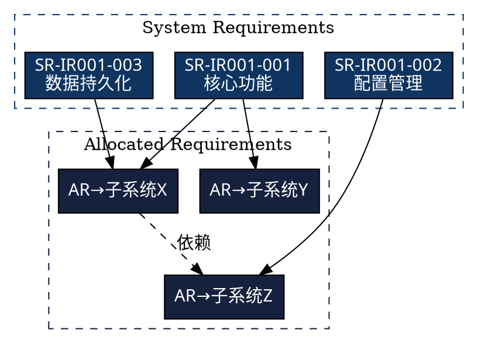

---

## 图表质量要求

- 所有图表标签使用 **中文**，接口/类名/编号使用 **英文**
- ASCII 图方框对齐、箭头清晰、标注完整
- 关键节点在 PlantUML/DOT 中使用 `style` / `fillcolor` 指令高亮着色
- 复杂图表添加 `title` / `label` 说明
- 箭头标注使用简短有意义的文字
- PlantUML 图表需标注 `@startuml/@enduml` 边界
- GraphViz 图表需标注 `digraph/graph` 声明及 `rankdir` 方向
- 交互阶段 ASCII 图 → 归档阶段同结构 PlantUML/DOT 源码，内容一致

### CJK 中文字体规范

图表渲染时中文乱码的根因是默认字体不支持 CJK 字符。**所有 PlantUML 和 GraphViz 源码必须指定 CJK 兼容字体**：

**PlantUML**：在 `@startuml` 后添加字体声明：
```
@startuml
skinparam defaultFontName Microsoft YaHei
```

**GraphViz DOT**：在节点/边/图声明中指定字体：
```
graph [fontname="Microsoft YaHei"];
node [fontname="Microsoft YaHei"];
edge [fontname="Microsoft YaHei"];
```

**跨平台 CJK 字体优先级**：

| 平台 | 推荐字体 | 备选字体 |
|------|---------|---------|
| Windows | Microsoft YaHei | SimHei、SimSun |
| macOS | PingFang SC | Heiti SC、STHeiti |
| Linux | Noto Sans CJK SC | WenQuanYi Micro Hei、Droid Sans Fallback |

> 渲染脚本（convert_docx.py / render_diagrams.py）会自动检测系统 CJK 字体并注入配置，但源码中也应显式指定以确保手动渲染时不乱码。