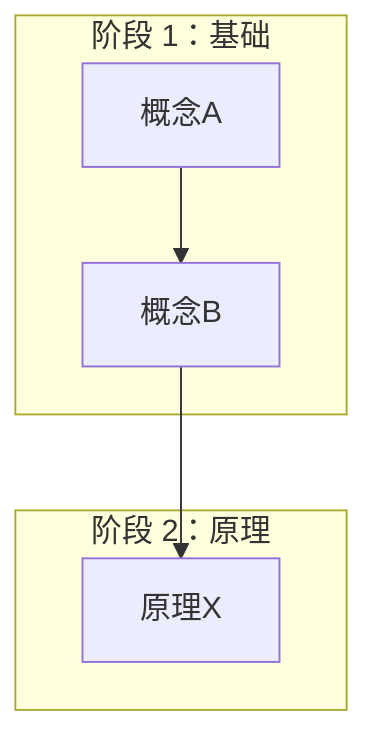
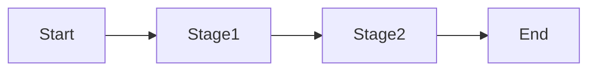

# 详细模板参考

本文档包含阶段 0 和阶段 1-6 的详细输出模板。当需要生成具体文件时，参考本文档。

---

## 阶段 0 模板

### roadmap.md 模板

```markdown
# 学习路线图：[主题]

> 生成日期: YYYY-MM-DD

## 领域概览
[2-3 段概述该领域，说明其核心价值和应用场景]

## 知识体系结构

[用一段话描述该领域的知识体系是如何由浅入深组织的]

## 阶段规划

| 阶段 | 名称 | 核心内容 | 预计耗时 | 前置依赖 |
|------|------|----------|----------|----------|
| 1 | 基础 | ... | ... | 无 |
| 2 | 原理 | ... | ... | 阶段 1 |
| 3 | 进阶 | ... | ... | 阶段 1-2 |
| 4 | 实战 | ... | ... | 阶段 1-3 |
| 5 | 融会贯通 | ... | ... | 阶段 1-4 |
| 6 | 前沿 | ... | ... | 阶段 1-5 |

## 各阶段详细目标

### 阶段 1：基础
- **目标：** [该阶段要达成的具体能力目标]
- **子主题：** [该阶段覆盖的子主题列表]
- **关键概念：** [该阶段的核心概念列表]
- **学习产出：** [学完后能做什么/理解什么]

[... 继续其他阶段 ...]

## 推荐资源
[按阶段分组的资源列表，标注权威级别]
```

### overview.md 模板（科普性整体介绍）

```markdown
# 科普性整体介绍：[主题]

> 阅读提示：本文用通俗语言讲述 [主题] 的完整故事，帮助你快速建立对这个领域的感性认知。
> 预计阅读时间：10-15 分钟

## 一、这个领域是什么？

[用 2-3 段通俗语言介绍这个领域，回答：
- 这个领域解决什么问题？
- 为什么它重要？
- 它在现实世界中有哪些应用？]

**一句话概括：** [用最简洁的一句话概括这个领域的本质]

## 二、这个领域的故事线

### 起点：从问题到基础概念

[讲述这个领域的起源故事：
- 人们遇到了什么问题？
- 为了解决问题，诞生了哪些基础概念？
- 这些概念解决了什么？又留下了什么新问题？]

> 🎯 **对应阶段 1（基础）**：你将学习这些基础概念的具体定义和用法。

### 发展：从基础到原理

[讲述基础概念如何发展成深层原理]

> 🎯 **对应阶段 2（原理）**

### 进阶：从原理到高级应用

[讲述原理如何支撑高级技术]

> 🎯 **对应阶段 3（进阶）**

### 实战：从理论到实践

[讲述如何将知识转化为实际能力]

> 🎯 **对应阶段 4（实战）**

### 融会贯通：知识串联与体系化

[讲述如何将零散的知识点串联成体系]

> 🎯 **对应阶段 5（融会贯通）**

### 前沿：从现状到未来

[讲述这个领域的发展趋势]

> 🎯 **对应阶段 6（前沿）**

## 三、知识点的自然衔接

**类比/案例：** [选择一个贴近生活的类比或典型案例]

[用类比讲述知识点衔接过程]

## 四、学习这个领域的价值

### 对个人的价值
[说明学习这个领域对个人成长的意义]

### 对社会的价值
[说明这个领域对社会的影响]

## 五、常见问题

**Q: 这个领域难学吗？**
A: [用通俗语言回答]

**Q: 需要什么前置知识？**
A: [列出必要的前置知识]

**Q: 学完后能做什么？**
A: [列举具体的应用场景]
```

### knowledge-graph.md 模板

```markdown
# 全局知识图谱：[主题]

> 生成日期: YYYY-MM-DD

## 一、知识全景图

### 图谱说明

**节点颜色含义：**
- 🟢 绿色：基础阶段（阶段 1）
- 🔵 蓝色：原理阶段（阶段 2）
- 🟡 黄色：进阶阶段（阶段 3）
- 🟠 橙色：实战阶段（阶段 4）
- 🟣 紫色：融会贯通（阶段 5）
- 🔴 红色：前沿阶段（阶段 6）

**箭头含义：**
- → `依赖`：学习 B 前需先掌握 A
- ⇄ `关联`：A 和 B 可相互参照

### 核心知识图谱



## 二、核心概念索引

| 概念 | 所属阶段 | 依赖概念 | 简要定义 |
|------|----------|----------|----------|
| 概念A | 阶段 1 | 无 | ... |

## 三、学习路径可视化



## 四、知识依赖详解

### 关键依赖链

[列出最重要的几条依赖链]

## 五、阶段间知识桥梁

| 衔接点 | 前阶段概念 | 后阶段依赖 | 学习建议 |
|--------|------------|------------|----------|
| 阶段1→2 | 概念C | 原理X | 确保理解透彻 |

## 六、动态更新

> 知识图谱会在每个阶段完成后动态更新。
```

---

## 阶段 1-6 模板

### notes.md 模板

```markdown
# 阶段 N: [阶段名称] — [主题]

> 最后更新: YYYY-MM-DD
> 来源: [URL 列表]

## 概述

[2-3 段概述段落]

## 核心内容

### [子标题 1]

[包含概念定义、示例的内容]

## 图解说明

[相关图示 - 使用 PlantUML/Graphviz/Mermaid]

## 关键术语

| 术语 | 定义 |
|------|------|
| ... | ... |

## 参考来源

1. [Source](URL) — [权威级别] [description]
```

### quiz.md 模板

```markdown
# 阶段 N 测验：[阶段名称] — [主题]

## 选择题

### 1. [题目]

A) ...  B) ...  C) ...  D) ...

<details><summary>答案</summary>
正确答案：...
解析：...
</details>

[至少 5 道选择题]

## 简答题

### 1. [题目]

<details><summary>参考答案</summary>
...
</details>

[至少 3 道简答题]

## 思考题

### 1. [题目]

*（开放式思考题）*

[至少 2 道思考题]
```

### practice.md 模板

```markdown
# 阶段 N 实战：[阶段名称] — [主题]

## 任务目标

[一句话任务目标]

## 前置条件

- [前置条件 1]
- [前置条件 2]

## 任务步骤

### 步骤 1：[名称]

**目标：** [具体目标]

**操作：**
```
[具体操作指令]
```

**预期结果：**
```
[预期输出或行为]
```

[至少 3 个步骤]

## 评判标准

- [ ] [可验证标准 1]
- [ ] [可验证标准 2]

## 常见问题

**Q: [常见问题]**
A: [解答]
```

---

## 图表工具规范

| 图表类型 | 工具 | 适用场景 |
|----------|------|----------|
| UML 类图/时序图 | PlantUML | 类结构、交互序列 |
| 架构图/拓扑图 | Graphviz | 系统组件关系 |
| 思维导图/流程图 | Mermaid | 知识层级、流程逻辑 |